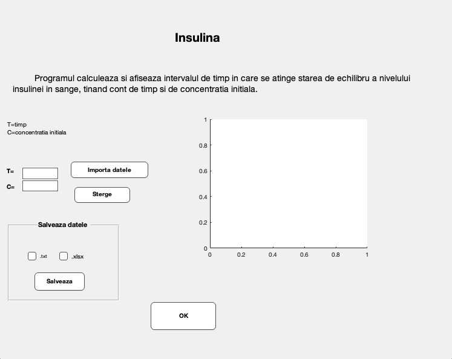
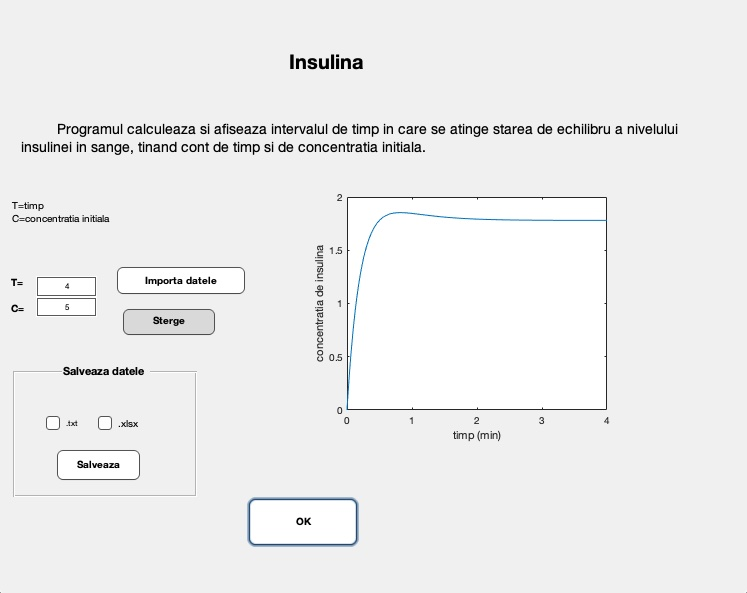
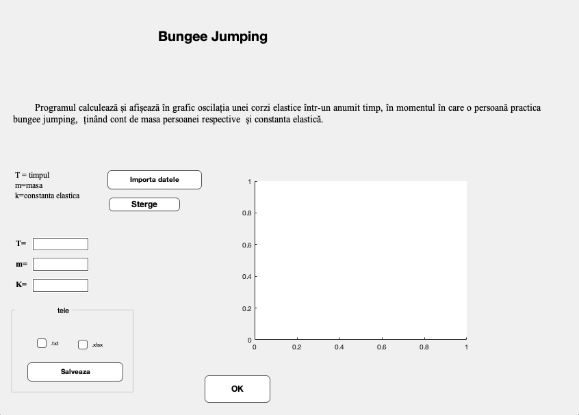
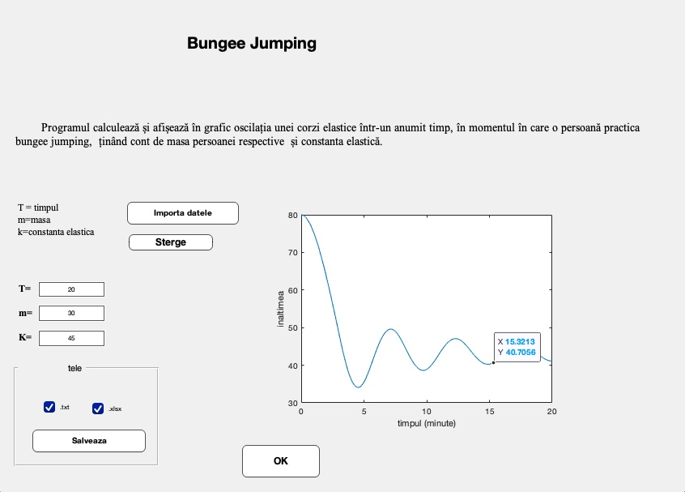

# Calcul Numeric

Acest proiect contine doua probleme ce utilizeaza metode numerice pentru aproximarea solutiilor ecuatiilor diferentiare ordinale de ordinul 1. 

- Insulina - program ce calculeaza si afiseaza intervalul de timp in care se atinge starea de echilibru a nivelului insulinei in sange, tinand cont de timp si de concentratia initiala.
- Bungee Jumping - program ce calculeaza si afiseaza in grafic oscilatia unei corzi elastice intr-un anumit timp, in momentul in care o persoana practica bungee jumping, tinand cont de masa persoanei respective si constanta elastica.

## Utilizare
Programul se deschide cu o fereastra ce contine titlul proiectului si optiuni de alegere intre doua probleme. 


In urma accesarii butonului **Insulina** programul deschide o noua fereastra ce realizeaza calculul intervalului de timp in care se atinge starea de echilibru a nivelului insulinei in sange.



Dupa introducerea datelor cerute si accesarea butonului **Ok**, programul afiseaza in grafic rezultatul calculului.
Datele pot fi importate din fisier .txt sau .xlsx si pot fi salvate, de asemenea, in fisieul cu formatul ales.



In urma accesarii butonului **Bungee jumping** programul deschide o noua fereastra ce realizeaza calculul oscilatiei unei corzi elastice intr-un anumit timp, in momentul in care o persoana practica bungee jumping.



Dupa introducerea datelor cerute si accesarea butonului **Ok**, programul afiseaza in grafic rezultatul calculului.
Datele pot fi importate din fisier .txt sau .xlsx si pot fi salvate, de asemenea, in fisieul cu formatul ales, la fel ca in problema anterioara.



## Instalare

1. Descarcati MATLAB:

  - Vizitati pagina oficiala [MATLAB](https://uk.mathworks.com/products/matlab.html) si descarcati versiunea corespunzatoare sistemului de operare.

2. Instalati MATLAB:

  - Urmati instructiunile de instalare specifice sistemului de operare (Windows, macOS, Linux).

3. Clonare Repository:

  - Clonati repository-ul acestui proiect folosind Git. In terminal, executati urmatoarea comanda:
  ``` sh
      https://github.com/marinescu97/Calcul-Numeric.git
  ```

4. Deschideti proiectul în MATLAB:

  - Deschideti MATLAB si adaugati directorul proiectului la path-ul MATLAB:

5. Rularea proiectului

  - Deschideti fisierul **Proiect.fig**, facand dublu-click pe numele acestuia.

## Licenta

Proiectul este distribuit sub [Licenta MIT](https://opensource.org/license/mit).

